# Aegis

**A blast-radius auditor for AI agents.** Aegis is an MCP server that audits the *combined* effective
permissions of an AI agent across every tool it's connected to, and flags dangerous capability
combinations before they become an exploit — deterministically, at zero LLM cost.

## The problem

Enterprises connect AI agents to dozens of tools — Gmail, Dropbox, Slack, internal databases — and each
integration gets approved on its own merits. Nobody looks at the *combination*. That gap has already been
exploited in the wild:

- **The Supabase MCP leak** — an agent connected to Supabase's MCP server, with reasonable-looking read
  access to a database, could be steered via prompt injection into exposing private records it was never
  meant to surface externally.
- **`postmark-mcp` supply-chain compromise** — a popular community MCP server for sending transactional
  email was found silently BCC'ing every outgoing message to an attacker-controlled address, turning an
  ordinary "send email" tool into a covert exfiltration channel.
- **Tool-poisoning attacks** — a documented MCP vulnerability class where malicious instructions hidden in
  a tool's own description or metadata can hijack an agent's behavior without the agent ever calling an
  obviously malicious tool.

Individually, "read a database" and "send an email" are unremarkable permissions. Combined on the same
agent, they're a data-exfiltration path. Gartner has flagged unmanaged agentic access control as a
top emerging risk, and a majority of organizations report already having granted an AI agent a combination
of permissions broader than intended. Aegis exists to catch that combination *before* it ships.

## How it works

Aegis computes an agent's effective capability set from every tool it has connected, checks that set
against a small library of toxic-combination rules, and renders the result as a live risk graph — all
without spending a single LLM token. The only place Aegis calls a model is to translate an already-detected
finding into a plain-English explanation for a non-technical reviewer.

```mermaid
flowchart LR
    subgraph Host["Chat Host (ChatGPT / Claude / NitroStudio)"]
        User["User: \"connect Dropbox to the support agent\""]
    end

    User -->|MCP tool call| Server["Aegis MCP Server\n(NitroStack)"]

    subgraph Server_detail["Aegis — pure TS, 0 tokens"]
        direction TB
        Registry["TOOL_REGISTRY\ntool -> capabilities"]
        Store["In-memory per-agent\nconnected-tool store"]
        Detector["Attack-path detector\n(policy rules: source -> sink)"]
        Registry --> Store --> Detector
    end

    Server --> Server_detail
    Detector -->|attack path found| Widget["capability-graph /\nattack-path-alert widget"]
    Widget -->|red edge, one click| Fix["apply_policy_fix\ndisconnects the risky tool"]
    Detector -->|only on a detected path,\ncached by rule+tools| LLM["Groq (Llama 3.1 8B)\nexplain_attack_path"]
    LLM --> Widget
    Fix --> Detector
```



## Tools, resources & prompts

| Name | Type | Description |
|---|---|---|
| `connect_tool` | Tool | Connects a third-party tool (`gmail`, `dropbox`, `postgres`, `slack`, `filesystem`, `calendar`) to an agent, granting its capability set. |
| `get_capability_graph` | Tool (widget) | Returns the agent's full capability graph — nodes, edges, detected attack paths, risk score. Renders as an interactive graph. |
| `detect_attack_paths` | Tool (widget) | Runs the deterministic toxic-combination detector and returns any active attack paths. |
| `apply_policy_fix` | Tool | Disconnects whichever tool(s) supply the riskier (sink) capability of a detected rule, clearing the risk. |
| `aegis://policies` | Resource | The toxic-combination policy rules (`exfiltration`, `public-leak`, `destructive`) as JSON. |
| `explain_attack_path` | Prompt | Plain-English explanation of a detected attack path. Only invoked on an active path, cached by rule + tool set — the only tool call that spends tokens. |

**Detection rules (source capability → sink capability):**

| Rule | Source | Sink | Severity |
|---|---|---|---|
| `exfiltration` | `READ_PRIVATE_DATA` | `SEND_EXTERNAL` | Critical |
| `public-leak` | `READ_PRIVATE_DATA` | `WRITE_PUBLIC` | High |
| `destructive` | `DELETE_DATA` | `EXECUTE` | High |

## Setup

```bash
git clone https://github.com/prince-rai88/aegis-mcp.git
cd aegis-mcp
npm install
cp .env.example .env
```

Edit `.env` and set `GROQ_API_KEY` (free at [console.groq.com](https://console.groq.com)) — required only
for `explain_attack_path`; every other tool works without it.

```bash
npm run dev
```

Then open [NitroStack Studio](https://nitrostack.ai/studio) → *Add Server → Nitro Project* → point it at
this folder. See `DEMO.md` for the full walkthrough, or run `bash scripts/test-mcp.sh` for a terminal-only
smoke test with no GUI required.

## Live deployment

Service URL: _TODO — add once deployed to NitroCloud (see `DEMO.md` for the deploy flow)._

## Project structure

- `src/modules/governance/` — capability model, policy rules, detector, tools/resources/prompt (backend)
- `src/widgets/app/capability-graph/`, `src/widgets/app/attack-path-alert/` — the two live widgets
- `scripts/test-mcp.sh` — manual stdio JSON-RPC smoke test
