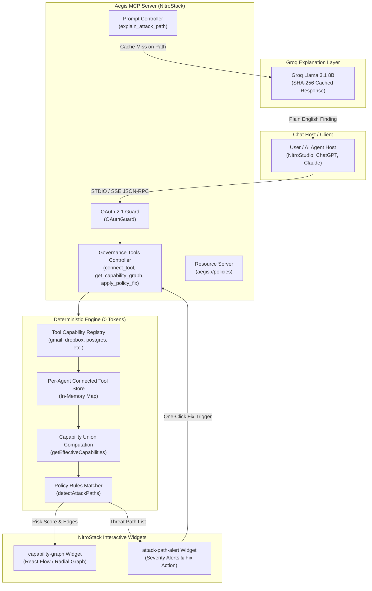

# Aegis 🛡️

[](https://nitrostack.ai)
[](https://modelcontextprotocol.io)
[](https://groq.com)
[](LICENSE)

> **A Blast-Radius Auditor for AI Agents**  
> *Track 03: Enterprise AI & Workplace Automation — NitroStack Hackathon*

Aegis is a Model Context Protocol (MCP) server built on **NitroStack** that audits the *combined* effective permissions of an AI agent across all connected tools. It deterministically detects toxic capability combinations and data exfiltration vectors before deployment — **at zero LLM token cost**.

---

## 📋 Table of Contents

- [The Problem & Threat Landscape](#-the-problem--threat-landscape)
- [System Architecture](#-system-architecture)
- [Detection & Remediation Lifecycle](#-detection--remediation-lifecycle)
- [Tool & Capability Registry](#-tool--capability-registry)
- [Toxic-Combination Policy Rules](#-toxic-combination-policy-rules)
- [MCP Interface Reference](#-mcp-interface-reference)
- [Interactive UI Widgets](#-interactive-ui-widgets)
- [2-Minute Hackathon Demo Script](#-2-minute-hackathon-demo-script)
- [Quickstart & Setup](#-quickstart)
- [Project Structure](#-project-structure)

---

## 🏆 Hackathon Overview

Enterprises connect AI agents to dozens of tools — Gmail, Dropbox, Postgres databases, Slack, filesystem execution. Each integration gets approved individually on its own merits, but **nobody audits what the agent can do when tools are combined**.

```
  ┌────────────────┐        ┌────────────────┐
  │  Dropbox MCP   │        │   Gmail MCP    │
  │ (Read Private) │        │ (Send External)│
  └───────┬────────┘        └───────┬────────┘
          │                         │
          └───────────┬─────────────┘
                      ▼
         ┌─────────────────────────┐
         │      Support Agent      │
         └────────────┬────────────┘
                      ▼
   🚨 TOXIC COMBINATION: DATA EXFILTRATION PATH
```

> [!WARNING]
> - `READ_PRIVATE_DATA` (Dropbox) + `SEND_EXTERNAL` (Gmail) = 🔴 **Data Exfiltration Path**
> - `READ_PRIVATE_DATA` (Postgres) + `WRITE_PUBLIC` (Slack) = 🟠 **Public Leak Path**
> - `DELETE_DATA` (Postgres) + `EXECUTE` (Filesystem) = 🟠 **Destructive Automation Vector**

---

## 📐 System Architecture

The high-level system architecture of Aegis demonstrates host integration, zero-token deterministic policy matching, interactive Next.js widget rendering, and cached LLM explanations:



---

## 🔄 Detection & Remediation Lifecycle

This sequence flowchart details the lifecycle from initial tool connection to automated attack path remediation:

```mermaid
flowchart LR
    A["1. User connects Gmail"] -->|connect_tool| B["Capability: READ_PRIVATE_DATA + SEND_EXTERNAL"]
    B --> C["Status: 🟢 SAFE (Risk Score: 0.0)"]
    C --> D["2. User connects Dropbox"]
    D -->|connect_tool| E["Capability: + WRITE_DATA"]
    E --> F["Detector: Checks Policy Matrix"]
    F -->|Match: READ_PRIVATE_DATA + SEND_EXTERNAL| G["🚨 EXFILTRATION PATH DETECTED!"]
    G --> H["3. Render Widgets"]
    H -->|get_capability_graph| I["Graph Edge turns RED (Risk Score: 1.0)"]
    H -->|explain_attack_path| J["Groq LLM: Plain English Summary"]
    I --> K["4. Remediation"]
    K -->|apply_policy_fix| L["Disconnect Sink Tool (Gmail/Dropbox)"]
    L --> M["Status Cleared: 🟢 SAFE (Risk Score: 0.0)"]
```



---

## 🚨 Real-World Threat Vectors

Aegis addresses emerging vulnerability classes documented in production MCP environments:

> [!IMPORTANT]
> - **The Supabase MCP Leak**: An agent connected to a database with legitimate read access was steered via prompt injection to exfiltrate private records through external communication tools.
> - **`postmark-mcp` Supply-Chain Attack**: A community MCP server for transactional email silently BCC'd outgoing messages to an attacker-controlled endpoint.
> - **Tool-Poisoning Attacks**: Malicious instructions hidden inside a tool's description hijack agent behavior without calling an explicitly malicious endpoint.

---

## 🛠️ Tool & Capability Registry

Aegis tracks capabilities across standard enterprise tools:

| Tool Icon | Tool ID | Granted Capabilities | Risk Profile |
|:---:|---|---|:---:|
| 📧 | `gmail` | `READ_PRIVATE_DATA`, `SEND_EXTERNAL` | 🟠 High |
| 📦 | `dropbox` | `READ_PRIVATE_DATA`, `WRITE_DATA`, `SEND_EXTERNAL` | 🟠 High |
| 🗄️ | `postgres` | `READ_PRIVATE_DATA`, `WRITE_DATA`, `DELETE_DATA` | 🔴 Critical |
| 💬 | `slack` | `WRITE_PUBLIC`, `SEND_EXTERNAL` | 🟡 Medium |
| 💻 | `filesystem` | `READ_PRIVATE_DATA`, `WRITE_DATA`, `EXECUTE` | 🔴 Critical |
| 📅 | `calendar` | `READ_PRIVATE_DATA`, `WRITE_DATA` | 🟢 Low |

---

## 🎯 Toxic-Combination Policy Rules

| Rule ID | Source Capability | Sink Capability | Severity | Policy Violation Description |
|---|---|---|:---:|---|
| `exfiltration` | `READ_PRIVATE_DATA` | `SEND_EXTERNAL` | 🔴 **Critical** | Agent can read private data AND transmit it externally. |
| `public-leak` | `READ_PRIVATE_DATA` | `WRITE_PUBLIC` | 🟠 **High** | Agent can read private records AND post them publicly. |
| `destructive` | `DELETE_DATA` | `EXECUTE` | 🟠 **High** | Agent can delete data AND execute unvalidated arbitrary code. |

---

## 🔌 MCP Interface Reference

### 1. Tools 🛠️

- **`connect_tool`**: Connects a tool (`gmail`, `dropbox`, `postgres`, `slack`, `filesystem`, `calendar`) to an agent. Guarded by `OAuthGuard`.
- **`get_capability_graph`**: Mapped to `@Widget('capability-graph')`. Returns graph nodes, danger edges, active attack paths, and risk score.
- **`detect_attack_paths`**: Mapped to `@Widget('attack-path-alert')`. Runs the deterministic rule engine and returns threat path summaries.
- **`apply_policy_fix`**: Remediates a detected attack path by removing the tool(s) supplying the sink capability.

### 2. Resources 📄

- **`aegis://policies`**: Exposes the toxic-combination policy rules matrix as JSON (`application/json`).

### 3. Prompts 💬

- **`explain_attack_path`**: Accepts `agentId` and `ruleId`. Generates plain-English security findings using Groq (`llama-3.1-8b-instant`), cached by SHA-256 hash.

---

## 🎨 Interactive Widgets

Aegis includes built-in Next.js React widgets rendered directly inside NitroStack Studio or MCP-compatible interfaces:

```
┌─────────────────────────────────────────────────────────────┐
│ 🛡️ Aegis Capability Graph                     Risk Score: 0.85│
├─────────────────────────────────────────────────────────────┤
│                                                             │
│         [ Dropbox ] ──(read private)──► ( READ_PRIVATE )    │
│                                               │             │
│                                           (exfiltration)    │
│                                               ▼             │
│         [ Gmail ]   ──(send external)─► ( SEND_EXTERNAL )   │
│                                                             │
│ 🔴 ALERT: Agent can read private data AND send externally   │
│ [ 🛠️ One-Click Policy Fix ]                                │
└─────────────────────────────────────────────────────────────┘
```

1. **`capability-graph`**: Radial/force graph visualization showing agent, tools, and capability nodes. Danger edges display in **red**.
2. **`attack-path-alert`**: Threat notification card highlighting active policy violations, affected tools, and a one-click **Fix** button.

---

## 🎬 2-Minute Hackathon Demo Script

```
 [0:00] Connect Gmail    ──►  connect_tool(gmail)       ──►  Capabilities added cleanly
 [0:40] Connect Dropbox  ──►  connect_tool(dropbox)     ──►  🔴 Exfiltration Edge lights up Red!
 [1:00] Explain Path     ──►  explain_attack_path       ──►  Plain-English summary (Groq Llama 3.1 8B)
 [1:20] One-Click Fix    ──►  apply_policy_fix          ──►  Sink tool disconnected (Risk Score = 0)
```

1. **Connect Tool 1**: *"Connect Gmail to support-agent"* → `connect_tool` fires, granting permissions cleanly.
2. **Connect Tool 2 (The Aha Moment)**: *"Now connect Dropbox to support-agent"* → `connect_tool` fires.
3. **View Graph**: *"Show capability graph"* → `get_capability_graph` renders widget with a **red animated exfiltration edge**.
4. **Explain Finding**: *"What does this mean?"* → `explain_attack_path` generates plain-English explanation via Groq.
5. **One-Click Fix**: Click **Fix** → `apply_policy_fix` disconnects the risky sink tool and clears the risk score to `0`.

---

## 🚀 Quickstart

### Prerequisites

- Node.js 18+
- Groq API Key (Free at [consolegroq.com](https://console.groq.com))

### Local Setup

```bash
git clone https://github.com/prince-rai88/aegis-mcp.git
cd aegis-mcp
npm install
cp .env.example .env
```

Add your `GROQ_API_KEY` to `.env`:
```env
GROQ_API_KEY=gsk_your_groq_key
```

Run the development server:
```bash
npm run dev
```

Run the terminal smoke test (no GUI required):
```bash
bash scripts/test-mcp.sh
```

### Connect to NitroStack Studio

Open [NitroStack Studio](https://nitrostack.ai/studio) → **Add Server** → **Nitro Project** → select `aegis-mcp`.

---

## 📁 Project Structure

```
aegis-mcp/
├── src/
│   ├── app.module.ts                 # NitroStack Root Module
│   ├── index.ts                      # Server bootstrap
│   ├── modules/
│   │   └── governance/               # Security Governance Engine
│   │       ├── capability.ts         # Capability definitions & tool registry
│   │       ├── detector.ts           # 0-token deterministic attack detector
│   │       ├── policies.ts           # Toxic-combination policy rules
│   │       ├── oauth.guard.ts        # NitroStack OAuth Guard
│   │       ├── governance.tools.ts   # Governance MCP Tools
│   │       ├── governance.resources.ts# Policy Resource (aegis://policies)
│   │       ├── governance.prompts.ts  # Groq explanation prompt
│   │       └── governance.module.ts  # Governance module registration
│   └── widgets/                      # NitroStack Interactive Widgets
│       ├── app/
│       │   ├── capability-graph/     # Capability Graph UI Widget
│       │   └── attack-path-alert/    # Attack Path Alert UI Widget
│       └── widget-manifest.json      # NitroStack Widget Manifest
├── scripts/
│   └── test-mcp.sh                   # Stdio JSON-RPC smoke test
├── CLAUDE.md                         # Architecture & team guidelines
├── DEMO.md                           # Hackathon presentation walkthrough
└── README.md                         # Project documentation
```

---

## 📜 License

[MIT](LICENSE)
