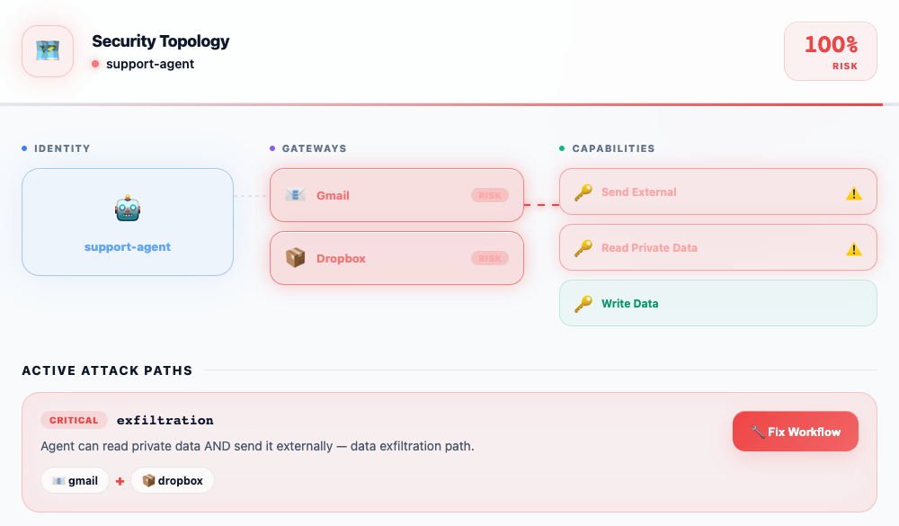
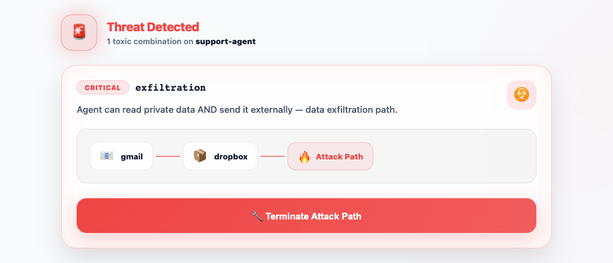
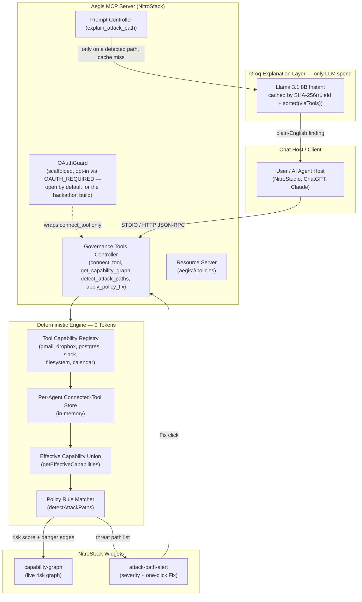

# Aegis 🛡️

[](https://nitrostack.ai)
[](https://modelcontextprotocol.io)
[](https://groq.com)
[](https://aegis-6a6d76ee-teamx-srmist.app.nitrocloud.ai/mcp)
[](LICENSE)

> **A Blast-Radius Auditor for AI Agents**
> *Track 03: Enterprise AI & Workplace Automation — NitroStack Hackathon*

Aegis is a Model Context Protocol (MCP) server built on **NitroStack** that audits the *combined* effective permissions of an AI agent across all connected tools. It deterministically detects toxic capability combinations and data-exfiltration vectors before deployment — **at zero LLM token cost**.

**🔴 Live server:** `https://aegis-6a6d76ee-teamx-srmist.app.nitrocloud.ai/mcp` — connect it to Claude, ChatGPT, or NitroStack Studio and run the demo below for real.

---

## 📋 Table of Contents

- [The Problem](#-the-problem)
- [See It Work](#-see-it-work)
- [System Architecture](#-system-architecture)
- [Detection & Remediation Lifecycle](#-detection--remediation-lifecycle)
- [Tool & Capability Registry](#-tool--capability-registry)
- [Toxic-Combination Policy Rules](#-toxic-combination-policy-rules)
- [MCP Interface Reference](#-mcp-interface-reference)
- [2-Minute Demo Script](#-2-minute-demo-script)
- [Quickstart](#-quickstart)
- [Project Structure](#-project-structure)

---

## 🏆 The Problem

Enterprises connect AI agents to dozens of tools — Gmail, Dropbox, Postgres databases, Slack, filesystem execution. Each integration gets approved individually on its own merits, but **nobody audits what the agent can do when tools are combined**.

```
  ┌────────────────┐        ┌────────────────┐
  │  Dropbox MCP   │        │   Gmail MCP    │
  │ (Read Private) │        │ (Send External)│
  └───────┬────────┘        └───────┬────────┘
          │                         │
          └───────────┬─────────────┘
                       ▼
         ┌─────────────────────────┐
         │      Support Agent      │
         └────────────┬────────────┘
                       ▼
   🚨 TOXIC COMBINATION: DATA EXFILTRATION PATH
```

> [!WARNING]
> - `READ_PRIVATE_DATA` (Dropbox) + `SEND_EXTERNAL` (Gmail) = 🔴 **Data Exfiltration Path**
> - `READ_PRIVATE_DATA` (Postgres) + `WRITE_PUBLIC` (Slack) = 🟠 **Public Leak Path**
> - `DELETE_DATA` (Postgres) + `EXECUTE` (Filesystem) = 🟠 **Destructive Automation Vector**

This isn't hypothetical — it's how the **Supabase MCP leak** happened (an agent with legitimate database read access was steered via prompt injection into exfiltrating private records through an external channel), how the **`postmark-mcp` supply-chain compromise** turned an ordinary "send email" tool into a covert BCC-to-attacker exfiltration path, and the exact mechanism behind documented **tool-poisoning attacks**, where malicious instructions hidden in a tool's own description hijack agent behavior without ever calling an obviously malicious endpoint. Individually-reasonable permissions become dangerous the moment they're combined, and nothing in the stack today computes that union before it's exploited.

---

## 📸 See It Work

Real, live-rendered screenshots — the actual widgets, fed the actual output of `get_capability_graph` / `detect_attack_paths` after connecting `gmail` + `dropbox` to one agent.

**The graph — dangerous capability paths render in red:**



**The alert — severity, affected tools, and one-click remediation:**



After clicking **Fix**, `apply_policy_fix` disconnects every tool supplying the sink capability and the graph goes back to `riskScore: 0` — no attack paths, clean state.

---

## 📐 System Architecture



---

## 🔄 Detection & Remediation Lifecycle

```mermaid
flowchart LR
    A["1. Connect Gmail"] -->|connect_tool| B["READ_PRIVATE_DATA + SEND_EXTERNAL"]
    B --> C["🟢 SAFE — riskScore 0"]
    C --> D["2. Connect Dropbox"]
    D -->|connect_tool| E["+ WRITE_DATA"]
    E --> F["Detector checks policy table"]
    F -->|source+sink both present| G["🚨 exfiltration DETECTED"]
    G --> H["3. Render widgets"]
    H -->|get_capability_graph| I["Graph edge turns RED — riskScore 1"]
    H -->|explain_attack_path| J["Groq: plain-English summary"]
    I --> K["4. Remediate"]
    K -->|apply_policy_fix| L["Every tool supplying the sink\ncapability is disconnected"]
    L --> M["Status cleared — riskScore 0"]
```



---

## 🛠️ Tool & Capability Registry

| Tool | Tool ID | Granted Capabilities | Risk Profile |
|:---:|---|---|:---:|
| 📧 | `gmail` | `READ_PRIVATE_DATA`, `SEND_EXTERNAL` | 🟠 High |
| 📦 | `dropbox` | `READ_PRIVATE_DATA`, `WRITE_DATA`, `SEND_EXTERNAL` | 🟠 High |
| 🗄️ | `postgres` | `READ_PRIVATE_DATA`, `WRITE_DATA`, `DELETE_DATA` | 🔴 Critical |
| 💬 | `slack` | `WRITE_PUBLIC`, `SEND_EXTERNAL` | 🟡 Medium |
| 💻 | `filesystem` | `READ_PRIVATE_DATA`, `WRITE_DATA`, `EXECUTE` | 🔴 Critical |
| 📅 | `calendar` | `READ_PRIVATE_DATA`, `WRITE_DATA` | 🟢 Low |

## 🎯 Toxic-Combination Policy Rules

| Rule ID | Source | Sink | Severity | Violation |
|---|---|---|:---:|---|
| `exfiltration` | `READ_PRIVATE_DATA` | `SEND_EXTERNAL` | 🔴 **Critical** | Agent can read private data AND transmit it externally. |
| `public-leak` | `READ_PRIVATE_DATA` | `WRITE_PUBLIC` | 🟠 **High** | Agent can read private records AND post them publicly. |
| `destructive` | `DELETE_DATA` | `EXECUTE` | 🟠 **High** | Agent can delete data AND execute unvalidated actions. |

Both tables are just data (`TOOL_REGISTRY` and `POLICY_RULES`) — adding a 7th tool or a 4th rule is a one-line change, not new logic.

---

## 🔌 MCP Interface Reference

**Tools**
- **`connect_tool`** — connects a tool (`gmail`, `dropbox`, `postgres`, `slack`, `filesystem`, `calendar`) to an agent. Wrapped in `OAuthGuard` (scaffolded — enforced only if `OAUTH_REQUIRED=true` is set; open by default for local/demo use).
- **`get_capability_graph`** — `@Widget('capability-graph')`. Returns nodes, danger edges, active attack paths, and risk score.
- **`detect_attack_paths`** — `@Widget('attack-path-alert')`. Runs the deterministic rule engine.
- **`apply_policy_fix`** — disconnects every tool supplying a detected rule's sink capability.

**Resource**
- **`aegis://policies`** — the toxic-combination policy table as JSON.

**Prompt**
- **`explain_attack_path`** — takes `agentId` + `ruleId`, returns a plain-English explanation via Groq (`llama-3.1-8b-instant`). Only fires on an already-detected path, cached by `SHA-256(ruleId + sorted(viaTools))` — this is the *only* step in the entire system that spends a token.

---

## 🎬 2-Minute Demo Script

```
 [0:00] Connect Gmail    ──►  connect_tool(gmail)     ──►  Capabilities added, nothing alarming
 [0:20] Connect Dropbox  ──►  connect_tool(dropbox)   ──►  🔴 Exfiltration edge lights up red
 [0:40] Show the graph   ──►  get_capability_graph    ──►  Live risk graph renders (see screenshot above)
 [1:00] Explain it       ──►  explain_attack_path     ──►  Plain-English summary — the only LLM call
 [1:20] Fix it            ──►  apply_policy_fix        ──►  Risky tool disconnected, riskScore → 0
```

Full script with talking points and judge Q&A prep: [`DEMO.md`](DEMO.md).

---

## 🚀 Quickstart

```bash
git clone https://github.com/prince-rai88/aegis-mcp.git
cd aegis-mcp
npm install
cp .env.example .env   # add GROQ_API_KEY — free at console.groq.com
npm run dev
```

Verify without any GUI:
```bash
bash scripts/test-mcp.sh
```

Or connect to [NitroStack Studio](https://nitrostack.ai/studio) → **Add Server** → **Nitro Project** → select this folder. See [`DEMO.md`](DEMO.md) for the full walkthrough, including connecting the live deployment to Claude or ChatGPT directly.

---

## 📁 Project Structure

```
aegis-mcp/
├── src/
│   ├── app.module.ts                  # NitroStack root module
│   ├── index.ts                       # Server bootstrap
│   ├── modules/governance/            # Security governance engine
│   │   ├── capability.ts              # Capability model + TOOL_REGISTRY
│   │   ├── detector.ts                # 0-token deterministic detector
│   │   ├── policies.ts                # Toxic-combination policy rules
│   │   ├── oauth.guard.ts             # Scaffolded OAuth guard
│   │   ├── governance.tools.ts        # The 4 MCP tools
│   │   ├── governance.resources.ts    # aegis://policies
│   │   ├── governance.prompts.ts      # Groq explanation prompt
│   │   └── governance.module.ts
│   └── widgets/app/
│       ├── capability-graph/          # Capability graph widget
│       └── attack-path-alert/         # Attack path alert widget
├── docs/screenshots/                  # Real rendered widget screenshots
├── scripts/
│   ├── test-mcp.sh                    # Stdio JSON-RPC smoke test
│   └── preview-widgets.html           # Local widget preview, no Studio needed
├── DEMO.md                            # Pitch + demo script
└── README.md
```

---

## 📜 License

[MIT](LICENSE)
