# Aegis 🛡️

**A blast-radius auditor for AI agents.** Aegis is a Model Context Protocol (MCP) server built with **NitroStack** that audits the *combined* effective permissions of an AI agent across all connected tools. It deterministically detects dangerous attack paths, capability escalation, and data exfiltration risks before deployment — at **zero LLM token cost**.

---

## 📋 Table of Contents

- [The Problem & Threat Landscape](#the-problem--threat-landscape)
- [Key Features](#key-features)
- [How It Works](#how-it-works)
- [Tool & Capability Matrix](#tool--capability-matrix)
- [Toxic Combination Rules](#toxic-combination-rules)
- [MCP Interface Reference](#mcp-interface-reference)
  - [Tools](#tools)
  - [Resources](#resources)
  - [Prompts](#prompts)
- [Interactive UI Widgets](#interactive-ui-widgets)
- [Getting Started](#getting-started)
- [Deployment & Studio Integration](#deployment--studio-integration)
- [Project Architecture](#project-architecture)
- [License](#license)

---

## 🚨 The Problem & Threat Landscape

Enterprises connect AI agents to dozens of services — Gmail, Dropbox, Slack, internal SQL databases, cloud storage, and command-line execution tools. Each integration is typically evaluated and approved in isolation. **Nobody checks the cumulative capability set.**

This blind spot creates severe security vulnerabilities already observed in production environments:

- **The Supabase MCP Leak**: An agent connected to a database with legitimate read access was steered via prompt injection to exfiltrate private records externally through secondary communication tools.
- **`postmark-mcp` Supply-Chain Attack**: A community MCP server for email delivery silently BCC'd outgoing communications to an attacker-controlled endpoint, converting a benign tool into a covert data exfiltration pipe.
- **Tool-Poisoning Attacks**: Malicious instructions embedded inside tool descriptions or schemas hijack agent execution without triggering traditional single-tool security alerts.

> **The Core Risk**: Individually, `READ_PRIVATE_DATA` (e.g., via Postgres or Dropbox) and `SEND_EXTERNAL` (e.g., via Gmail or Slack) appear harmless. Combined on a single AI agent, they create an automated **data exfiltration vector**. Aegis catches these toxic combinations *before* agents are deployed.

---

## ✨ Key Features

- **⚡ Zero-Token Deterministic Core**: Evaluates capability sets and detects toxic paths entirely in TypeScript. No LLM tokens spent during policy analysis.
- **🎯 Dynamic Capability Unioning**: Computes the real-time effective permission boundary as tools are attached or removed from an agent.
- **📊 Live Interactive Widgets**: Renders dynamic, interactive React Flow graphs (`capability-graph`) and threat notification lists (`attack-path-alert`).
- **💡 Smart LLM Explanations**: Uses Groq (`llama-3.1-8b-instant`) **only** when an active threat is detected, with SHA-256 hash caching to eliminate redundant LLM calls.
- **🛠️ Automated One-Click Remediation**: Instantly isolates and disconnects sink tools (`apply_policy_fix`) to eliminate active attack vectors.
- **🔐 OAuth 2.1 Guarded**: Protects tool registration endpoints using NitroStack's extensible `OAuthGuard`.

---

## ⚙️ How It Works

Aegis evaluates tool connection requests, computes the aggregate union of granted capabilities, checks against a predefined matrix of toxic policy rules, and exposes live interactive widgets directly to chat host environments (NitroStudio, ChatGPT, Claude Desktop).

```mermaid
flowchart LR
    subgraph Host["Chat Host (ChatGPT / Claude / NitroStudio)"]
        User["User: \"Connect Dropbox to support-agent\""]
    end

    User -->|MCP Tool Call| Server["Aegis MCP Server\n(NitroStack Framework)"]

    subgraph Core["Aegis Engine (0 Tokens)"]
        direction TB
        Registry["TOOL_REGISTRY\n(Tools -> Granted Caps)"]
        Store["In-Memory Store\n(Per-Agent Connected Tools)"]
        Detector["Attack Path Detector\n(Source -> Sink Policy Rules)"]
        Registry --> Store --> Detector
    end

    Server --> Core
    Detector -->|Threat Found| Widgets["Interactive Widgets\n(capability-graph / attack-path-alert)"]
    Widgets -->|Red Danger Edge| Fix["apply_policy_fix\n(Disconnects Sink Tools)"]
    Detector -->|Cache Miss on Threat| Groq["Groq API\n(Llama 3.1 8B Explanation)"]
    Groq --> Widgets
    Fix --> Detector
```



---

## 🗺️ Tool & Capability Matrix

Aegis maintains an authoritative mapping of third-party tools to their underlying privilege levels:

| Tool ID | Granted Capabilities | Privilege Level |
|---|---|---|
| `gmail` | `READ_PRIVATE_DATA`, `SEND_EXTERNAL` | High |
| `dropbox` | `READ_PRIVATE_DATA`, `WRITE_DATA`, `SEND_EXTERNAL` | High |
| `postgres` | `READ_PRIVATE_DATA`, `WRITE_DATA`, `DELETE_DATA` | Critical |
| `slack` | `WRITE_PUBLIC`, `SEND_EXTERNAL` | Medium |
| `filesystem` | `READ_PRIVATE_DATA`, `WRITE_DATA`, `EXECUTE` | Critical |
| `calendar` | `READ_PRIVATE_DATA`, `WRITE_DATA` | Low |

---

## 🛡️ Toxic Combination Rules

Aegis evaluates capability pairs (`Source` → `Sink`) to detect architectural threat paths:

| Rule ID | Source Capability | Sink Capability | Severity | Risk Score Weight | Description |
|---|---|---|---|---|---|
| `exfiltration` | `READ_PRIVATE_DATA` | `SEND_EXTERNAL` | **Critical** | `1.0` | Agent can read confidential data AND transmit it to an external network. |
| `public-leak` | `READ_PRIVATE_DATA` | `WRITE_PUBLIC` | **High** | `0.6` | Agent can read private records AND publish them to public channels. |
| `destructive` | `DELETE_DATA` | `EXECUTE` | **High** | `0.6` | Agent can delete data stores AND execute unvalidated arbitrary code. |

*Overall agent risk score is calculated as `min(1.0, sum(severity_weights))`.*

---

## 🔌 MCP Interface Reference

### Tools

Aegis exposes 4 core MCP tools via `@nitrostack/core`:

#### 1. `connect_tool`
- **Description**: Connects a third-party tool to an agent and computes the updated effective capability set. Protected by `OAuthGuard`.
- **Input Schema**:
  ```json
  {
    "agentId": "support-agent",
    "toolId": "dropbox"
  }
  ```
- **Response**: Returns `connectedTools` list and `effectiveCapabilities`.

#### 2. `get_capability_graph`
- **Description**: Generates the complete graph structure for an agent. Mapped to `@Widget('capability-graph')`.
- **Input Schema**:
  ```json
  {
    "agentId": "support-agent"
  }
  ```
- **Response**: Returns `nodes`, `edges` (with `danger: true` flags), `attackPaths`, and `riskScore`.

#### 3. `detect_attack_paths`
- **Description**: Executes the deterministic toxic-combination detector. Mapped to `@Widget('attack-path-alert')`.
- **Input Schema**:
  ```json
  {
    "agentId": "support-agent"
  }
  ```
- **Response**: Returns an array of detected attack paths, severity levels, and current `riskScore`.

#### 4. `apply_policy_fix`
- **Description**: Remediates an active attack path by disconnecting the tools supplying the dangerous sink capability.
- **Input Schema**:
  ```json
  {
    "agentId": "support-agent",
    "ruleId": "exfiltration"
  }
  ```
- **Response**: Returns the refreshed, risk-cleared capability graph.

---

### Resources

#### `aegis://policies`
- **Name**: Aegis Policies
- **MIME Type**: `application/json`
- **Description**: Exposes the active policy rules matrix used for toxic capability detection.

---

### Prompts

#### `explain_attack_path`
- **Name**: `explain_attack_path`
- **Arguments**: `agentId` (string, required), `ruleId` (string, required)
- **Description**: Translates complex security findings into clear, non-technical executive summaries using Groq (`llama-3.1-8b-instant`). Responses are cached by a SHA-256 hash of `ruleId + sorted(viaTools)` to minimize API overhead.

---

## 🎨 Interactive UI Widgets

Aegis includes Next.js frontend widgets designed for real-time visualization within MCP-compliant canvas interfaces:

1. **Capability Graph Widget** (`capability-graph`):
   - Interactive React Flow radial graph showing Agent, Tool, and Capability nodes.
   - Highlights active attack paths with **animated red edges**.
   - Displays live risk score indicators (`0.00` to `1.00`).

2. **Attack Path Alert Widget** (`attack-path-alert`):
   - Severity-coded threat notifications (**Critical** / **High** / **Medium**).
   - Lists specific contributing tools (`viaTools`).
   - Provides a one-click automated remediation trigger (`apply_policy_fix`).

---

## 🚀 Getting Started

### Prerequisites

- **Node.js**: v18.0.0 or higher
- **npm**: v9.0.0 or higher
- **Groq API Key**: Free key from [console.groq.com](https://console.groq.com) *(Required only for `explain_attack_path` prompt explanations)*

### Installation & Setup

1. **Clone the repository**:
   ```bash
   git clone https://github.com/prince-rai88/aegis-mcp.git
   cd aegis-mcp
   ```

2. **Install dependencies**:
   ```bash
   npm install
   ```

3. **Configure Environment Variables**:
   ```bash
   cp .env.example .env
   ```
   Edit `.env` and supply your Groq API key:
   ```env
   GROQ_API_KEY=gsk_your_groq_api_key_here
   ```

4. **Run Development Server**:
   ```bash
   npm run dev
   ```

5. **Run Terminal Smoke Test**:
   Execute the automated stdio JSON-RPC test script to verify server initialization without a GUI:
   ```bash
   bash scripts/test-mcp.sh
   ```

---

## 🌐 Deployment & Studio Integration

### Connecting to NitroStack Studio

1. Launch [NitroStack Studio](https://nitrostack.ai/studio).
2. Click **Add Server** → **Nitro Project**.
3. Point Studio to your local `aegis-mcp` directory.
4. Test tool execution directly in the App Canvas.

### Deploying to NitroCloud

1. Sign in to [NitroCloud Console](https://nitrostack.ai).
2. Create a new Nitrostack App `aegis-mcp`.
3. Navigate to **MCP** → **Deployments** → **Deploy from GitHub**.
4. Select repository `prince-rai88/aegis-mcp` and branch `main`.
5. Enable **Auto-Deploy** and click **Deploy**.
6. Copy your generated SSE Service URL (e.g., `https://aegis-mcp.nitrostack.app/sse`).

---

## 📁 Project Architecture

```
aegis-mcp/
├── src/
│   ├── index.ts                      # App entry point
│   ├── app.module.ts                 # Main NitroStack app module
│   ├── modules/
│   │   └── governance/               # Core Security Governance Module
│   │       ├── capability.ts         # Capability types, tool registry & per-agent store
│   │       ├── detector.ts           # Zero-token deterministic toxic path detector
│   │       ├── policies.ts           # Policy rule definitions & risk scoring
│   │       ├── oauth.guard.ts        # OAuth 2.1 authentication guard
│   │       ├── governance.tools.ts   # Governance MCP Tools (@Tool, @Widget)
│   │       ├── governance.resources.ts# Aegis Policy Resources (@Resource)
│   │       ├── governance.prompts.ts  # Groq-powered Explanations (@Prompt)
│   │       └── governance.module.ts  # Governance module definition
│   └── widgets/                      # Next.js Frontend Widgets
│       ├── app/
│       │   ├── capability-graph/     # React Flow dynamic capability graph
│       │   └── attack-path-alert/    # Severity threat alert list widget
│       ├── package.json              # Widget dependencies
│       └── widget-manifest.json      # NitroStack widget registration manifest
├── scripts/
│   └── test-mcp.sh                   # Stdio JSON-RPC smoke test script
├── CLAUDE.md                         # Internal development & team architecture guide
├── DEMO.md                           # Step-by-step hackathon demo script
├── package.json                      # Project dependencies & scripts
└── tsconfig.json                     # TypeScript compiler configuration
```

---

## 📄 License

This project is licensed under the [MIT License](LICENSE).
